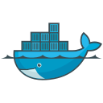

<h1 align="center">
  
</h1>

  
  

  

- :office: &nbsp;I'm currently working at **[Oreyeon]** as a Backend Engineer
- :seedling: &nbsp;I’m currently working on my cloud & deployment skills
- :speech_balloon: &nbsp;I like to talk about **cloud tools** and **development practices**
- :computer: &nbsp;Connect with me on **[LinkedIn]**

 

<h2 align="left" id="macropower-tech">Favorite Tech</h2>

> Tools, languages, and other things that I like to work with.

<table>
  <tr>
    <td align="center" width="96">
        
       Go
    </td>
    <td align="center" width="96">
        
       Python
    </td>
    <td align="center" width="96">
      
       Kubernetes
    </td>
    <td align="center" width="96"> 
      
       Docker
    </td>
  </tr>
</table>

<h2 align="left">Contribution Graph</h2>

<!-- links -->

[Oreyeon]: https://oreyeon.com
[linkedin]: https://www.linkedin.com/in/amir-bou-ghanem "Amir Bou Ghanem LinkedIn"
